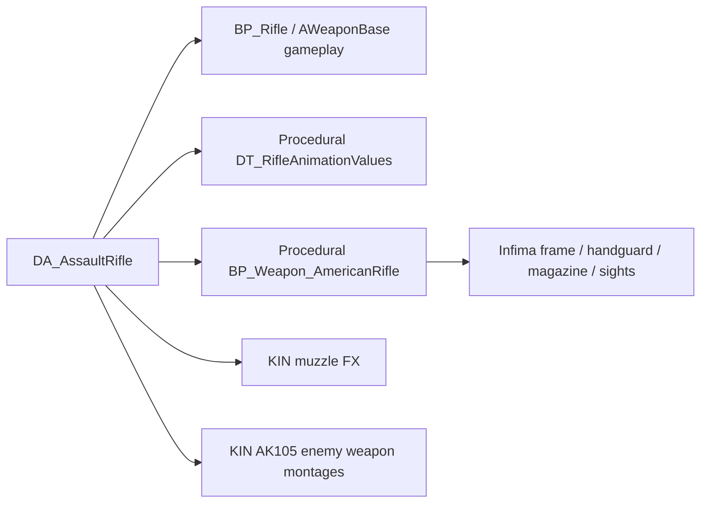
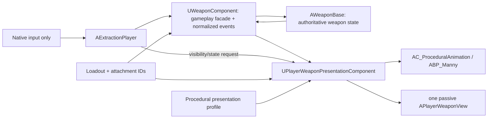

# Player weapon system — verified map and scalable architecture

**Research date:** 17 July 2026  
**Branch:** `Player-Setup` at `427952db`  
**Scope:** research and architecture only  
**Status:** final after independent evidence/architecture review  
**Verification:** fresh `ExtractionEditor` build; live editor/Blueprint/AnimBP inspection without PIE, Simulate, asset saves, or source changes

## Decision

Keep **Procedural FPS Kit as the sole player-presentation owner** for the current weapon-system milestone. Keep `AWeaponBase` and `UWeaponComponent` as the sole gameplay authority. Use Infima for weapon/attachment art and adapt it behind a project-owned, validated Procedural presentation contract. KINEMATION may supply selected source animations, rigs, sounds, or FX, but its runtime player, camera, IK, ADS, input, ammo, and reload systems must not execute alongside Procedural.

This matches the project brief: Infima supplies the arsenal and attachments while player visuals/holding states remain Procedural. It also preserves the existing player mesh, AnimBP, traversal, takedown, revive, DBNO, camera, and movement work.

If KINEMATION's exact camera/weapon feel is mandatory, treat that as a separate player-presentation migration. Prove one rifle on a duplicated player skeleton before altering the production player. Do not attempt a dual-runtime hybrid; both systems would write the weapon, hands, ADS, recoil, camera, and action state.

The recommended ownership is:

```text
ProjectExtract C++       = gameplay, ammo, fire, hitscan, reload state, movement policy
Procedural FPS Kit       = the one executing player pose/IK/ADS presentation system
Infima                   = weapon and attachment art/source rigs
KINEMATION               = optional source assets, or a future full replacement—not a second owner
```

## Direct answer to the scope question

The current scope is not made to work by the C++ `GripSocket` on the weapon.

Procedural discovers optics by component tag `OpticSight`, then requires a socket named `OpticAimpoint` on that tagged component's mesh. Missing `OpticAimpoint` sockets are explicitly skipped. Iron sights use paired `FrontSight{index}`/`RearSight{index}` component tags and require `FrontAimpoint`/`RearAimpoint` sockets.

The current ADS system is fragile for new scopes for four confirmed reasons:

1. `Calculate Optics` consumes the authored `OpticAimpoint` socket transform and preserves its relative Y/Z and rotation. The source mesh origin is irrelevant when that socket is correct; a missing, misplaced, or misoriented socket changes or removes the solved optic.
2. It overwrites relative X with `DistanceFromCamera`, and the project bridge hard-codes that value to `30.f` for every weapon and optic. There is no per-optic eye-relief/camera-distance policy.
3. All valid irons and optics are appended into one `HandTransforms` array. `Change Sight` stores only an integer index; adding/removing components can change enumeration order and make the selected index refer to a different sight.
4. Optic selection is convention-based and untyped. There is no stable attachment ID linked to one validated AimPoint.

The user was right that a socket is involved: the relevant optic socket is `OpticAimpoint` on the tagged optic component mesh. The scalable fix is not to keep editing marketplace meshes. Each project optic wrapper should expose one typed AimPoint marker and stable attachment identity; the presentation adapter should pass that explicit transform into the existing Procedural calculation.

## What is active in the project

### Effective player

The active map is `/Game/UWC_Modular_Skyscraper/Maps/DemoMap`. It has no WorldSettings GameMode override.

| Setting | Active asset |
|---|---|
| Global GameMode | `/Game/Core/Blueprints/Game/BP_ExtractionGameMode` |
| Default pawn | `/Game/ProceduralFPSKIT/Blueprints/BP_ExtractionCharacter_C` |
| PlayerController | `/Game/Core/Blueprints/Game/BP_ExtractionPlayerController_C` |
| Native pawn parent | `AExtractionPlayer` |
| Active gameplay weapon | `/Game/Core/Weapons/BP_Rifle_C` |

`BP_ExtractionCharacter` has no separate first-person arms skeletal component. The same full character mesh drives the visible arms/body.

BP-added components include:

- `AC_ProceduralRecoil`
- `AC_Interaction`
- `SpringArm`
- `FirstPersonCamera`
- `WeaponSpawn`
- `AC_ProceduralAnimation`
- `AC_Vault`
- `Effector`
- `TakedownKnife`
- `DownedPP`

Native/inherited components include movement, `CharacterMesh0`, health, footsteps, `Weapon`, traversal, companion command, and consumable inventory.

### Active mesh, skeleton, and AnimBP

`CharacterMesh0` uses:

- Mesh: `/Game/Military_Mega_Bundle/Mesh/Preset/Characters/SKM_Character_03`
- AnimClass: `/Game/ProceduralFPSKIT/Demo/Character/Mannequins/Animations/ABP_Manny_C`
- Mode: Animation Blueprint
- Transform: Z `-89`, yaw `-90`, scale `1`

The skeleton has physical `ik_hand_gun`, `ik_hand_l`, and `ik_hand_r` bones. Its exposed virtual bones are only:

- `VB hand_r`
- `VB hand_l`
- `VB hand_gun`

It lacks KINEMATION's `VB ik_hand_gun_pivot`, `VB lowerarm_l`, `VB lowerarm_r`, `VB recoil_hand_r`, `VB ik_hand_gun_pose`, and `VB Curves`. The active player is a Procedural player retargeted onto the Military mesh, not a partly integrated KIN player.

Startup also reports outdated Procedural Manny pose assets affecting hands, lower arms, clavicles, legs, and related bones. That is a plausible contributor to pose quality and must be cleared before judging final grip polish, but it does not change the ownership architecture.

## The current assault-rifle chain

The current rifle is already a mixed-pack setup. That is exactly where the cross-pack problem began.



### `DA_AssaultRifle`

| Field | Current value |
|---|---|
| Fire rate / automatic | `10` rounds/s / true |
| Magazine / reserve | `30` / `300` |
| Reload time | `2.2` seconds |
| ADS FOV / transition | `65` / `0.15` seconds |
| ADS movement speed | `200` cm/s |
| Muzzle FX | KIN `NS_MuzzleFlash_Rifle_01` |
| Player pose data | Procedural `DT_RifleAnimationValues` |
| Player visual class | Procedural `BP_Weapon_AmericanRifle_C` |
| Enemy body reload | `AM_Enemy_AK105_Reload` |
| Enemy weapon fire/reload | KIN AK105 weapon montages |
| Enemy left-hand socket | `None` |

The KIN references here serve FX/enemy presentation. They do not make KIN the player's animation owner.

Both `BP_Rifle` and `BP_AssaultRifle` use this DataAsset and set `MagazineComponentName=None`, so the native third-person magazine-swap path intentionally does nothing for the player kit.

The active class is `BP_Rifle`. Its native `WeaponMesh` uses Procedural `SKM_AmericanRifle`, is `OwnerNoSee`, and has the authored rifle action bones. Its only skeleton sockets are:

- `Muzzle`
- `BulletCasing`

It has no `GripSocket`, `FrontAimpoint`, `RearAimpoint`, or `OpticAimpoint`. Therefore `UWeaponComponent::SeatWeaponGripSocket` cannot perform its intended `GripSocket` re-seat on the active gameplay mesh; the actor remains attached by its mesh/root origin. This does not directly align the separately spawned first-person visual.

`BP_AssaultRifle` is not the active default. It instead has a static `RifleMesh` under the native skeletal component, using `SM_Rifle_Olive`, while the native skeletal component has no mesh assigned.

### First-person visual: `BP_Weapon_AmericanRifle`

This Blueprint derives from `BP_Weapon_AutomaticBase`/`BP_Item_Base`, not `AWeaponBase`. It is the separate presentation actor spawned by the player Blueprint.

`BP_Item_Base` supplies:

| Component | Base contract |
|---|---|
| `Item_Mesh` | Skeletal mesh component; tags `MainMesh` and `OpticSight`; no base mesh |
| `FrontSight` | `SM_FrontSight`; tag `FrontSight1`; yaw `90` |
| `RearSight` | `SM_RearSight`; tag `RearSight1` |
| `OpticSight` | No base mesh; tag `OpticSight`; yaw `90` |
| `Grip` | No base mesh or tag |
| Other | `SpareMag`, `Muzzle`, `Laser` |

`BP_Weapon_AmericanRifle` locally adds Infima components:

| Component | Parent / transform | Tag |
|---|---|---|
| `SM_AssaultRifle_Sight_Rear` | `Item_Mesh`; location `(0, 2.363710, 6.705340)` | `RearSight2` |
| `SM_AssaultRifle_Sight_Front_Folded` | reported under handguard; location `(0, 23.274478, 2.435062)` | `FrontSight2` |
| `SM_AssaultRifle_Handguard` | `Item_Mesh`; location `(0, 16.505056, 4.424982)` | none confirmed |
| `SM_AssaultRifle_Magazine` | `Item_Mesh`; location `(0, 12.361095, -6.932792)` | none confirmed |

The asset package also references the Infima assault-rifle frame. Live introspection could not expose the final child overrides for inherited `Item_Mesh`, `OpticSight`, `FrontSight`, `RearSight`, or `Grip`, so their final mesh/socket transforms are not claimed here. The front sight's parent was also inconsistent between the hierarchy and individual component query. Those are tooling boundaries, not inferred facts.

## The three different things currently called a weapon

| Representation | Purpose | Local-player visibility |
|---|---|---|
| `AWeaponBase` gameplay actor | Ammo, cadence, hitscan, damage, reload state/timing, controller recoil, noise, replication, authoritative FX | Native mesh is owner-hidden |
| Procedural kit first-person actor | Visible gun assembly, sights, grip metadata, pose/action presentation, first-person muzzle | This is what the player sees |
| Optional `ThirdPersonVisualActor` | Preassembled visual actor used by enemy/companion/third-person configurations | Not the player's main first-person presentation |

The separation is correct in principle. The problem is that the presentation actor lifecycle and metadata live inside vendor Blueprint conventions while C++ retains only indirect events and a first-person muzzle pointer.

## Current equip, input, fire, ADS, and reload ownership

### Equip

1. `UWeaponComponent` spawns the authoritative `BP_Rifle`/`AWeaponBase`.
2. It attaches that actor to the character mesh at `ik_hand_gun`.
3. It attempts the missing `GripSocket` re-seat, which cannot run on the current `SKM_AmericanRifle`.
4. C++ fires the Blueprint `OnWeaponEquipped` event.
5. `BP_ExtractionCharacter::OnWeaponEquipped` validates the native weapon, gets `KitWeaponPoseAsset` and `KitVisualWeaponClass`, destroys/replaces the prior visual, and records the kit slot/`SpawnedItemRef` state.
6. It passes the presentation actor's `Muzzle` component to native `SetFirstPersonMuzzle`.
7. It executes `Set ProceduralValues -> New Hand Pose -> Set LeftHand`.

Equip can be notified during spawn, replication catch-up, `BeginPlay`, and controller-change catch-up. The presentation path must remain idempotent; historical duplicate visuals prove this is not theoretical.

### Input: confirmed duplicate callback surface

The native CDO assigns:

- `FireAction = /Game/ProceduralFPSKIT/Input/Actions/IA_Shoot`
- `ReloadAction = /Game/ProceduralFPSKIT/Input/Actions/IA_Reload`
- `ADSAction = /Game/ProceduralFPSKIT/Input/Actions/IA_Aim`

The child Blueprint also contains persisted Enhanced Input action event nodes for those exact assets. One input action can therefore invoke both the native binding and retained Blueprint callback paths.

Confirmed Blueprint paths include:

- `IA_Reload.Triggered -> Branch -> BP_Item_Base.Reload`.
- `IA_Aim` Started and Completed/Canceled paths.
- `IA_Shoot` Started and Completed paths reaching kit movement/fire-state logic and `Stop Fire`.
- Two `Begin Fire` calls whose target pins are connected but whose exec inputs were not connected in the retrieved pin table; those calls appear dead, but the whole kit input surface is not dead.

The gameplay shot path is native C++:

```text
IA_Shoot native binding
  -> AExtractionPlayer::FireStart / FireStop
  -> UWeaponComponent::StartFire / StopFire
  -> AWeaponBase::StartFiring / FireShot
  -> server ammo + camera-forward hitscan + damage + FX
```

The retained kit callbacks still handle presentation/state and can duplicate reload/ADS calls. The exact runtime ordering was not observed because PIE was intentionally not started. This is a current WARNING and the first ownership cleanup required before adding weapons.

`BP_ExtractionCharacter` has no `OnWeaponFired` bind/event node. `AC_ProceduralAnimation` and the visual weapon were not proven free of every fire binding, so the report does not claim the entire vendor fire graph is absent.

### Fire and ballistic aim

For the player, `AWeaponBase::PerformHitscan` starts at `PlayerController::GetPlayerViewPoint` and follows camera forward. The current ballistic zero is the camera, not the optic or muzzle.

The visible muzzle is an FX origin. Controller-rotation recoil is gameplay recoil. Any animation-system recoil must be cosmetic or it will double-apply aim movement.

This architecture preserves camera-forward COD/Battlefield-style shooting. A physical bore-zero/convergence model would be a separate design decision.

### ADS

The native path is:

```text
IA_Aim native binding
  -> AExtractionPlayer::ADSStart / ADSStop
  -> UWeaponComponent::SetAiming
  -> AWeaponBase aiming/recoil state
  -> AExtractionPlayer::OnADSChanged
```

`OnADSChanged` writes kit `IsAim`, branches on native `bIsADS`, executes the corresponding `New Hand Pose`, then calls the character's `Aim Down Sight` function. Native ADS state is therefore the confirmed entry point for the kit pose swap, even though the retained Blueprint IA callbacks also exist.

`UWeaponDataAsset` contains `ADSFOV`, `ADSTransitionTime`, and `ADSMovementSpeed`, but the native player ADS path does not consume them. `UExtractionAnimInstance::bIsADS` and its weapon-family state are also not set by the traced C++ path.

The kit bridge currently returns:

- `IK_HandGun` offset: identity
- `IK_HandR` offset: identity
- `IK_HandL` offset: identity
- Aim distance from camera: hard-coded `30.f`

Those are direct cross-pack constraints, not harmless defaults.

### Reload

For magazine weapons, C++ sets `Reloading`, arms a timer using `WeaponData->ReloadTime`, then transfers ammo and returns to Idle in `OnReloadFinished`.

Shell-by-shell reload is different. `AWeaponBase::HandleShellInserted` validates authority/state/data, awards exactly one shell, advances montage sections, and finishes when full/out of reserve. A safety timer remains in place. The current system can therefore use an animation notify as a gameplay phase signal, but ammo mutation still occurs inside the authoritative weapon after validation.

The target must preserve this distinction:

- Tactical/empty magazine reload: C++ owns state, duration, and ammo transfer; presentation selects the visual variant and scales it to authoritative timing.
- Shell-by-shell reload: a notify or presentation event may request `ShellInserted`, but `AWeaponBase` validates authority, current phase, minimum cadence, reserve, and interruption before awarding a shell.
- Cosmetic notifies may move/hide a magazine, bolt, slide, pump, or shell; they do not write ammo directly.

## Verified Procedural ADS contract

### Discovery and selection

`AC_ProceduralAnimation::Found Iron Sights` builds one `HandTransforms` array:

1. Clear the array.
2. Loop from `1` through `IronsightLimit`.
3. Find components tagged `FrontSight{index}`.
4. Require socket `FrontAimpoint`; otherwise skip.
5. Find matching components tagged `RearSight{index}`.
6. Require socket `RearAimpoint`; otherwise skip.
7. Calculate and append the iron ADS transform.
8. Enumerate every component tagged `OpticSight`.
9. Require socket `OpticAimpoint`; otherwise skip.
10. Calculate and append each valid optic ADS transform.

There is explicit `Does Socket Exist` validation. Unreal's generic component-origin fallback is not used by this caller.

Irons are appended first; optics follow in component enumeration order. `Change Sight` cycles an integer `CurrentSight` through valid array indices and resets to zero at the end. It does not track attachment identity. This is why index ordering is unsafe for modular optics.

### Iron calculation

`Calculate Sight Locs`:

- Normalizes `FrontTransform.Location - RearAimpointLocation`.
- Uses the rear socket rotation's Up and Right vectors.
- Uses dot products followed by asin to derive pitch/yaw corrections.
- Negates pitch and combines the correction with rear-socket rotation.

Iron alignment therefore requires two authored points with correct rotations, not one generic sight socket.

### Optic calculation

`Calculate Optics`:

1. Makes the incoming sight transform relative to character socket `ik_hand_gun`.
2. Preserves relative Y/Z and rotation.
3. Replaces relative X with `DistanceFromCamera`.
4. Composes that offset with the first-person camera world transform.
5. Returns the result relative to character socket `head`.

The function assumes `ik_hand_gun` and `head` exist. The current active skeleton has them. The fixed X distance and preserved authored Y/Z/rotation explain why each scope needs a correctly placed/oriented `OpticAimpoint` and explicit eye-relief calibration. The source mesh origin by itself is not a failure when the socket transform is correct.

## Verified AnimBP hand path

In `ABP_Manny`:

1. `Anim_Arms_AmericanRifle_Pose` feeds `Blend Poses (ENUM_Animset)` input 3.
2. `EquippedAnimset` selects the weapon pose.
3. The pose passes through the `UpperBody` slot and layers over locomotion/Control Rig.
4. The result enters linked graph `ABP_FP_ArmsProcedural` through `InPose`.
5. The linked result returns to the main downstream slot/final-pose chain.

Inside `ABP_FP_ArmsProcedural`, the confirmed IK chain is:

```text
Local To Component
├─ Copy hand_l -> ik_hand_l
└─ Copy VB hand_gun -> ik_hand_gun
   -> Two Bone IK hand_r
   -> Two Bone IK hand_l
   -> Component To Local
```

Additional behavior:

- Procedural `Modify Bone` nodes move `VB hand_gun`.
- `WeaponAlpha` and `MeleeAlpha` drive weapon-pivot modifications.
- `ReloadAimAlpha` drives the reverse copy `ik_hand_gun -> VB hand_gun`.
- `LeftHandPose` selects `Blend Poses (ENUM_LeftHand)` from authored/mirrored sequences and propagates through `ik_hand_l`.

`NewHandPose` is not an AnimGraph node. The graph-facing left-hand value is `LeftHandPose`; the exact assignment between the component's `NewHandPose` event/function and that graph variable could not be exposed. The surrounding equip call and final IK path are confirmed.

## Grip diagnosis

Grip is three independent contracts:

1. **Weapon seat:** weapon/view root relative to `ik_hand_gun`.
2. **Right-hand/finger pose:** authored by the selected animation family.
3. **Support hand:** target transform, finger pose, and elbow/pole behavior for the base handguard or an underbarrel grip.

The active gameplay mesh has no `GripSocket`, so its C++ re-seat path is inactive. The visible Infima geometry is a separate actor using the Procedural rifle base pose. The current kit bridge supplies identity hand offsets. A foreign pistol grip, stock length, handguard, rail height, and origin will therefore not automatically match the Procedural pose.

The installed rifle pose data includes a normal support-hand transform plus authored vertical- and angled-grip pose/transform variants. These profiles are selected; they are not calculated from geometry. A scalable profile needs a support-hand target, hand/finger pose, and optional elbow hint. A single `GripSocket` is insufficient.

## Pack boundary

| Pack | Strength | Required runtime contract | Project role |
|---|---|---|---|
| Procedural FPS Kit | Current player pose, camera, locomotion presentation, ADS, grip IK, rifle/pistol/shotgun action f…332 tokens truncated…ons

| Option | Risk | Blast radius | Verdict |
|---|---:|---:|---|
| Procedural owner + mixed source assets | Medium | Weapon presentation, content profiles, attachments, validation | Recommended |
| KIN owner + C++ gameplay | Very high | Player skeleton, AnimBP, camera, interfaces, inputs, all actions and existing player states | One-rifle spike only after director override |
| Both runtime owners | Highest | Both surfaces plus continuous ordering/synchronization | Reject |

Mixing source assets is fine. Mixing executing presentation owners is not.

## Recommended target architecture

### Normalized event flow

`UWeaponComponent` should be the weapon-state facade and normalized event hub. It already owns equip and aiming and can forward the equipped `AWeaponBase` delegates.



The normalized surface needs:

- Weapon changed/equipped/unequipped.
- Trigger held changed.
- Shot accepted/fired.
- Aiming changed.
- Reload started, phase changed, completed, interrupted.
- Attachment set changed.

The presentation component binds once to `UWeaponComponent`, owns one weak reference to the current weapon, unbinds the old weapon/delegates on replacement, destroys the old view idempotently, and removes bindings in `EndPlay`. Player states such as traversal/takedown/DBNO/revive call the presentation component's single visibility API.

After migration, remove the BP `IA_Shoot`, `IA_Reload`, and `IA_Aim` action handling. The Blueprint no longer owns gameplay-shaped input; it receives normalized state from the presentation component.

### Ownership

`AWeaponBase`/`UWeaponComponent` own:

- Selected gameplay weapon.
- Ammo/reserve.
- Fire acceptance, rate and mode.
- Hitscan, damage, noise, suppression, replication.
- Reload state, phase, timing, interruption and ammo mutation.
- Controller/gameplay recoil.
- ADS movement-speed policy.

`UPlayerWeaponPresentationComponent` owns:

- Exactly one first-person view actor.
- Applying the Procedural animation profile.
- Resolving/cacheing weapon/optic/grip markers.
- Solved ADS transform and FOV transition.
- Support-hand target/pose/hint.
- Visual fire/reload/inspect and cosmetic moving parts.
- First-person muzzle/casing FX anchors.
- Attachment visuals.
- Hide/show/restore across player states.

### Data model

Keep `UWeaponDataAsset` as the shared weapon definition and add one direct reference to a focused player-presentation profile. Do not add a generalized strategy hierarchy while only one presentation backend ships.

Extend the existing `EWeaponType`—currently only Unarmed/Pistol/Rifle—with `SMG` and `Shotgun`; do not create a duplicate family enum. Store the selected type on the weapon definition and use it consistently for animation/profile lookup. The current player swap path is disabled and there is no real loadout API, so loadout selection must later call a deliberate `UWeaponComponent::EquipWeapon` path rather than reviving vendor slot switching.

| Record | Owns |
|---|---|
| `UWeaponDataAsset` | Gameplay values, `EWeaponType`, ADS movement speed, default presentation profile reference, shared FX/noise/enemy data |
| Procedural presentation profile | Passive view class, Procedural pose/action data, base ADS FOV/transition, base aim distance/eye relief, action variants, required marker/bone policy |
| Attachment definition | Stable ID, finite slot, compatibility, passive visual class, gameplay modifiers; optic or grip presentation overrides |
| Loadout | Weapon ID/class and selected attachment IDs before mission |

An optic may override FOV, transition, sensitivity, eye relief, and AimPoint. `ADSMovementSpeed` remains gameplay movement policy and must finally be consumed when aiming. The current identity IK offsets and hard-coded `30.f` are retired; the resolved profile/markers supply those values.

### Structurally passive view wrappers

Create a project `APlayerWeaponView` base with:

- No input binding and `AutoReceiveInput=Disabled`.
- No replication, collision, damage, ammo, traces, or gameplay fire/reload interface.
- Tick disabled unless a measured visual feature needs it.
- Typed marker components and explicit accessors.
- Vendor meshes/components inserted as children; never spawn a vendor gameplay weapon Blueprint as the player view.

The validator can reliably require this base class and explicit properties. It must not claim to prove that an arbitrary vendor graph contains no gameplay behavior.

### Marker coordinate contract and runtime dataflow

Project wrappers normalize coordinates:

- `+X` = weapon/optic forward, downrange.
- `+Y` = right.
- `+Z` = up.
- Optic `AimPoint` origin = chosen optical/eye-box reference on the sight axis.
- Optional `EyeReliefCm` is separate from the marker transform.

The Procedural legacy asset uses different authored orientations in places; the adapter handles that conversion once.

Authoritative geometry source:

1. The presentation profile selects animation sequences/curves and default policy.
2. The weapon wrapper markers are authoritative for weapon-specific geometry: seat, irons, support hand, muzzle, casing, rail.
3. The equipped optic wrapper overrides the active AimPoint/eye relief/FOV.
4. An underbarrel grip wrapper overrides only the support-hand profile.
5. On equip or attachment change, `UPlayerWeaponPresentationComponent` resolves typed component transforms once and caches a `ResolvedPresentation` struct keyed by stable weapon/attachment IDs.
6. At equip time it solves `WeaponSeat` against the character's `ik_hand_gun` pivot and calls `ApplyResolvedWeaponSeat(WeaponId, ViewActor, SeatToRoot)`. The adapter attaches the passive view root to `ik_hand_gun` and applies the inverse seat-to-root transform, so the authored `WeaponSeat` marker—not the third-party mesh origin—lands exactly on the pivot. The result is cached and reapplied after view recreation; unequip detaches and clears it.
7. It calls a project adapter API `ApplyResolvedSight(SightId, AimSource, DistanceFromCamera)`. For irons, the adapter runs the explicit rear/front markers through `Calculate Sight Locs` and then `Calculate Optics`; for an optic, it passes the typed AimPoint directly to `Calculate Optics`.
8. The adapter writes the returned character-relative transform to one `ActiveADSTransform` consumed by `Aim Down Sight`. Project loadouts select this transform by stable `SightId`; they do not append to or index the vendor `HandTransforms` array. `CurrentSight` remains only for legacy/demo sight cycling during migration.
9. During migration only, the current `FrontSight*`/`RearSight*`/`OpticSight` sockets are converted into the resolved struct and assigned a stable ID.

This makes the scene markers actually drive the kit; the validator is not pretending to bridge them. `ApplyResolvedWeaponSeat`, `ApplyResolvedSight`, and the `Aim Down Sight -> ActiveADSTransform` read are mandatory implementation seams, not optional cleanup.

The editor preview should draw:

- Weapon +X axis.
- Muzzle/bore ray.
- Rear-to-front iron ray.
- Optic AimPoint +X ray and eye-relief position.
- Expected camera axis.

Validation checks angular alignment and declared axes, not merely marker existence.

### Weapon wrapper markers

Each weapon view supplies:

- `WeaponSeat`
- `SupportHandTarget`
- optional `SupportHandHint`
- `IronRear`
- `IronFront`
- one or more typed `OpticMount` rails
- `Muzzle`
- `Casing`
- moving-part mapping for magazine/bolt/slide/pump/charging handle

Each optic view supplies one typed `AimPoint`, mount root, eye relief, FOV/transition override, reticle/render data, and compatible rail policy.

Each underbarrel grip may override support-hand target, finger/hand pose, elbow hint, and IK weight. It must not change the optic solution. An optic must not change the grip profile.

The grip bridge is equally explicit. `UPlayerWeaponPresentationComponent` calls `ApplyResolvedGrip(GripId, PoseId, EffectorCS, JointTargetCS, IKWeight)` on the project animation adapter whenever the weapon or underbarrel grip changes. It converts `SupportHandTarget` and `SupportHandHint` from wrapper space into `CharacterMesh0` component space first. The adapter writes a native/project-owned resolved-grip state that `ABP_FP_ArmsProcedural` reads for `LeftHandPose`, the `hand_l` Two Bone IK effector, joint target, and blend alpha. Unequip resets that state.

`NewHandPose` may remain the transition/legacy pose-selection call, but it is no longer the source of weapon-specific geometry. If the current linked AnimBP cannot read a native resolved-grip state, the one-rifle implementation must add a project AnimInstance parent/setter or duplicate the smallest linked layer; it must not leave the support-hand markers disconnected.

The invariant is:

> Optic changes may change the solved camera-relative weapon/hands transform, but they do not edit the authored base profile and do not change camera-forward ballistics.

### Moving-part content strategies

There are three valid content lanes:

1. **Canonical re-rig:** skin the combined Infima weapon to the selected Procedural family skeleton and reuse/adapt its actions.
2. **Canonical driver skeleton + modular rigid parts:** play actions on a canonical hidden/visible driver and attach separate Infima magazine, bolt, slide, pump, handguard, and sight components to corresponding bones/sockets. This suits modular art when pivots are clean and avoids re-skinning rigid parts.
3. **Native Infima rig:** preserve its skeleton and author/export paired character and weapon actions, dispatched through the Procedural presentation owner.

The current Infima assembly makes lane 2 worth measuring against lane 1 in the one-AR spike. It is not proven cheaper until magazine/bolt/charging-handle pivots and action coverage are tested. Deforming or inseparable parts still require re-rigging or native-rig actions.

## New weapon workflow

1. Select the extended `EWeaponType` and closest Procedural action family.
2. Choose and document one moving-part lane: canonical re-rig, canonical modular driver, or native rig.
3. Create a child of the passive project weapon-view template; insert Infima art without editing vendor originals.
4. Map magazine, bolt/slide/pump, charging handle, trigger, selector, and other action parts.
5. Author normalized seat, support-hand, hint, iron, rail, muzzle, and casing markers.
6. Create the Procedural presentation profile with base pose/actions, FOV/transition, aim distance/eye relief, and required validation policy.
7. Configure `UWeaponDataAsset` gameplay values and ADS movement speed independently.
8. Add compatible attachment definitions by stable ID.
9. Run structural, skeleton, marker-axis, action, and transform validation.
10. Run the user-owned gameplay/visual matrix before marking ready.

### Family plan

| Family | Starting point | Main content risk |
|---|---|---|
| Assault rifle | Current Procedural rifle pose/actions | Formalize current mixed wrapper; prove optic/grip and choose driver vs re-rig |
| Pistol | Procedural Pistol/Heavy Pistol | Slide/magazine action rig; one- vs two-hand support profile |
| Shotgun | Procedural Shotgun | Match pump/semi-auto geometry and shell-by-shell phases |
| SMG | No dedicated installed Procedural/KIN family | Start from stocked rifle pose, then author a named SMG profile/actions; never ship as an undocumented rifle alias |

## New optic workflow

1. Create a passive project optic wrapper.
2. Place the third-party mesh under its mount root.
3. Place one typed AimPoint at the optical/eye-box reference; +X points downrange and +Z is up.
4. Configure eye relief, FOV/magnification, transition, sensitivity, reticle/render data, and compatible rails.
5. Run the editor visualizer and angular/axis validation.
6. Validate against every declared compatible weapon.
7. Check hip-to-ADS, steady ADS, recoil return, lean, crouch, high/low pitch, sprint exit, and removal.

Adding an optic must never require editing `BP_ExtractionCharacter` or the weapon's authored base pose. If it does, the boundary has leaked.

## Validation

### Structural errors

Block readiness when:

- View class is not the passive project base or has input/replication/collision enabled.
- Required weapon marker is missing/duplicated.
- Optic has zero or multiple AimPoints.
- Marker coordinate axes fail angular tolerances.
- Attachment mount/compatibility is missing.
- Required skeleton bone/socket/virtual bone is absent.
- Character and weapon actions target incompatible skeletons.
- Required action part mapping is absent.
- First-person muzzle/casing cannot resolve.
- Two-handed weapon lacks support-hand target/pose.
- Profile still relies on identity legacy offsets or unexplained hard-coded camera distance.

### Automated checks

- Explicit optic and iron transform solve tests.
- Optic swap changes active resolved AimPoint but not ballistic direction/base authored profile.
- Grip swap changes only support-hand resolution.
- Repeated equip/catch-up leaves one view actor and attachment set.
- Native input produces one gameplay fire/reload/ADS callback after BP input removal.
- Magazine reload presentation follows authoritative timing.
- Shell insertion is accepted only once per valid authoritative phase/cadence.
- Every weapon type resolves required markers, actions, moving parts, muzzle, and casing.

### Manual visual matrix

| Scenario | Expected outcome |
|---|---|
| Hip idle/move/run/sprint | Stable weapon/hands; no duplicate or stale attachments |
| Iron ADS | Rear/front line centers and returns cleanly to hip |
| Every optic on every compatible rail | Correct optical center/eye relief; stable selection by attachment ID |
| Standard/vertical/angled/no support grip | Only support-hand profile changes; ADS remains valid |
| Hip/ADS fire | One gameplay shot/recoil; muzzle/tracer from visible muzzle |
| Tactical/empty magazine reload | Correct visual variant; ammo changes once through C++ |
| Shell-by-shell reload | One validated shell per phase; interruption stops later awards |
| Lean/crouch/high-low pitch/sprint transitions | Sight and hand solutions remain stable |
| Traversal/takedown/DBNO/revive | One view hides/restores in the correct state |
| Repeated equip/catch-up | Exactly one view and attachment set |
| Missing/bad AimPoint | Validator blocks readiness; no silent fallback/index mismatch |

## Migration sequence

### 0. Director gate and baseline

- Default choice: preserve Procedural ownership.
- Override only if KIN's exact feel is worth a separate player migration.
- The user records the current AR's hip, iron ADS, recoil, sprint, reload, grip, muzzle, lean, traversal, takedown, and revive behavior before implementation.

### 1. Remove split input/presentation authority

- Add normalized `UWeaponComponent` state events.
- Establish one `UPlayerWeaponPresentationComponent`.
- Move view lifecycle, muzzle handoff, visibility and vendor pose calls behind it.
- Remove retained BP IA_Shoot/IA_Reload/IA_Aim handling.
- Verify idempotent equip and delegate cleanup.

### 2. Reproduce the existing AR without changing its look

- Create the first typed profile/wrapper from the current rifle.
- Resolve existing iron/optic socket transforms into the explicit runtime struct.
- Replace identity offsets and fixed camera distance with profile data.
- Apply `ADSFOV`, transition, and movement-speed policy through their correct owners.

### 3. Prove modular optic/grip onboarding

- One current optic and one new Infima/third-party optic.
- Standard, vertical, and angled support-hand profiles.
- Stable attachment IDs instead of `CurrentSight` array position.
- Editor visualization and validation.

### 4. Prove one Infima AR end to end

- Compare canonical re-rig and canonical modular-driver lanes.
- Pass irons, optic, grip variants, fire, tactical/empty reload, moving parts, muzzle, sprint, lean, traversal, takedown, revive, and repeated equip.
- Turn the proven process into the reusable weapon/optic setup skill and templates.

### 5. Expand weapon types

- Extend the existing enum and `UWeaponComponent` equip/loadout API.
- Add pistol, shotgun, then the explicitly authored SMG profile.
- Do not revive the vendor slot system as the project loadout architecture.

### 6. Add attachment gameplay effects and pre-mission loadout

- Loadout selects stable weapon/attachment IDs.
- Gameplay modifiers flow into C++ weapon/movement data.
- Optic/grip view actors remain presentation-only.

## Known evidence boundaries and side findings

- No PIE was started, so current visual quality and callback ordering are not claimed as runtime passes.
- Final inherited component overrides on the current visual rifle could not be fully enumerated, but base/local contracts and the ADS caller were traced.
- The exact current vendor assignment from `NewHandPose` to AnimBP `LeftHandPose` remains outside the exposed AnimGraphs. The target `ApplyResolvedGrip -> resolved AnimInstance state -> ABP_FP_ArmsProcedural` bridge is deliberately explicit and does not depend on that unresolved vendor link.
- Startup SCS warning `Reparenting the 'Mag' component ... possible cyclic linkage` matches KIN `BP_TR15`, `BP_AK105`, or `BP_Mk14EBR`, most likely the companion TR15 chain. It is not the player visual's `SM_AssaultRifle_Magazine` and is a separate cleanup item.
- `EWeaponType` and loadout/swap are currently incomplete; this architecture maps where that work belongs but does not implement it.
- The old `agent_docs/weapon_mesh_pipeline.md` remains useful for canonical re-rigging, but its duplicate-assets/no-C++ conclusion is superseded by this optic/grip/input/validation architecture.

## Evidence sources

### Local

- `Extraction/Source/Extraction/Private/Components/WeaponComponent.cpp`
- `Extraction/Source/Extraction/Private/Weapon/WeaponBase.cpp`
- `Extraction/Source/Extraction/Public/Weapon/WeaponBase.h`
- `Extraction/Source/Extraction/Public/Data/WeaponDataAsset.h`
- `Extraction/Source/Extraction/Private/Character/ExtractionPlayer.cpp`
- `Extraction/Source/Extraction/Private/Animation/ExtractionAnimInstance.cpp`
- `Extraction/Source/Extraction/Public/Core/ExtractionTypes.h`
- `agent_docs/project_brainstorm_timeline.md`
- `agent_docs/input_movement_architecture.md`
- `agent_docs/weapon_mesh_pipeline.md`
- Git history: `58917a40`, `2ca70c67`, `16693410`, `1869b0f9`
- Live assets: `BP_ExtractionCharacter`, `ABP_Manny`, `ABP_FP_ArmsProcedural`, `AC_ProceduralAnimation`, `DA_AssaultRifle`, `BP_Rifle`, `BP_Weapon_AmericanRifle`, `BP_Item_Base`, and the active Military skeleton

### Official vendor/engine documentation

- Procedural FPS Kit: <https://unrealfpskit.com/docs/>
- KINEMATION character/AnimBP contract: <https://kinemation.gitbook.io/tactical-shooter-pack-unreal/animations/character>
- KINEMATION overview: <https://kinemation.gitbook.io/tactical-shooter-pack-unreal/tutorial/overview>
- KINEMATION mesh-swap status: <https://kinemation.gitbook.io/tactical-shooter-pack-unreal/tutorial/how-to-swap-weapon-mesh>
- KINEMATION FPS integration status: <https://kinemation.gitbook.io/tactical-shooter-pack-unreal/tutorial/fps-animation-pack-integration>
- Infima FAQ: <https://docs.infimagames.com/product/rigged-gun-model-packs/learn/faq>
- Infima separate character/weapon animation export: <https://docs.infimagames.com/product/rigged-gun-model-packs/learn/guides/how-to-export-animations-from-blender-to-unreal-engine-5>
- Unreal socket transform behavior: <https://dev.epicgames.com/documentation/en-us/unreal-engine/BlueprintAPI/Transformation/GetSocketTransform>

## Approval gate for implementation

The default implementation direction is the verified Procedural-owner architecture above. The only director override is choosing a deliberate KIN player-presentation migration and its one-rifle feasibility spike. A dual-owner runtime is not a viable third option.


