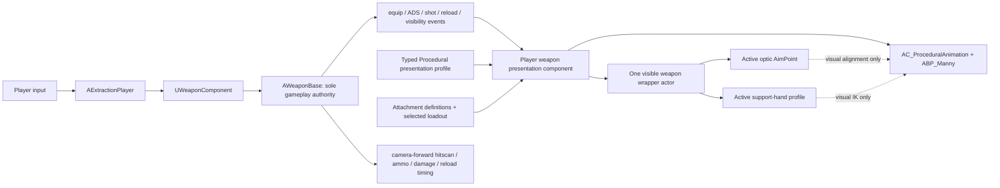

# Player weapon system: current map and scalable architecture

**Research date:** 17 July 2026  
**Branch inspected:** `Player-Setup` at `427952db`  
**Scope:** research and architecture only; no gameplay, Blueprint, animation, mesh, or DataAsset changes  
**Engine inspection:** fresh `ExtractionEditor` build, live editor inspection without PIE or Simulate

## Decision

Keep **Procedural FPS Kit as the sole player-presentation owner** for the current weapon-system milestone. Keep `AWeaponBase` and `UWeaponComponent` as the sole gameplay authority. Treat Infima as the weapon-art source and adapt its weapons and attachments into the Procedural presentation contract. KINEMATION assets may be retargeted and reused, but its runtime character, camera, ADS, IK, input, ammo, and action systems must not run alongside Procedural.

That is the lowest-risk architecture and it matches the written project intent: Infima supplies the weapons and attachments while the player's visuals and holding states stay on Procedural FPS Kit. It also preserves the current player, traversal, takedown, revive, camera, and Military-mesh integration.

KINEMATION should become the player-presentation owner only if its exact camera and weapon feel is a director-level requirement worth a separate migration milestone. It is not a mesh or grip-pose integration. It would require a player skeleton, AnimBP, camera, interface, input, action, recoil, and reload migration. If that direction is wanted, prove one rifle on a duplicated player skeleton before changing the production player.

The acceptable mixed-source setup is:

- ProjectExtract owns gameplay and content definitions.
- Procedural FPS Kit is the one executing player-presentation system.
- Infima supplies weapon and attachment art.
- Selected KINEMATION animations, sounds, FX, or source rigs may be adapted into the Procedural path.

Do not build a dual-runtime Procedural/KIN hybrid. Both systems write the weapon, hands, ADS pose, recoil, camera, and action state; making them cooperate would be more work and less deterministic than choosing either one.

## What is actually wrong now

The current problems are not one bad socket. They come from five boundaries that are currently implicit.

1. **The visible player weapon is not the C++ gameplay weapon.** The player has separate gameplay and presentation actors. The hard-coded C++ `GripSocket` aligns the gameplay actor attached to `ik_hand_gun`; it does not, by itself, fix the separately spawned first-person weapon that the player sees.
2. **The Procedural kit expects its own sight metadata.** Iron sights and optics use different component tags and aim anchors. A new scope mesh from another pack does not automatically contain the tag and `OpticAimpoint` datum that the Procedural solver expects.
3. **A missing socket does not fail loudly.** Unreal's `GetSocketTransform` returns the component transform when the requested socket is absent. A scope without the expected aim socket can therefore look valid to the graph while ADS silently aligns the scope's mesh origin instead of its optical axis.
4. **Grip is two separate problems.** Right-hand weapon seating and left/support-hand posing are independent. A weapon can be seated correctly at the right hand while the support hand, fingers, or elbow are wrong because the new gun's geometry does not match the authored Procedural pose and transforms.
5. **Different weapon rigs cannot inherit moving-part animation through offsets.** A transform can fix idle pose and sight alignment. It cannot make an Infima magazine, bolt, slide, pump, or charging handle follow animations authored for a Procedural or KIN weapon skeleton. Shipping-quality actions need a compatible target rig and paired character/weapon animations.

The missing piece is a project-owned, validated presentation contract. New weapons and optics are currently assembled by copying vendor Blueprints and relying on convention, with no schema or validator to stop a missing tag, socket, skeleton, action bone, or duplicate input owner.

## Research method and confidence

The findings combine four evidence sources:

- Static C++ tracing of the player, weapon component, gameplay weapon, data, animation instance, and kit bridge.
- Git history and existing project design/migration documents.
- Read-only live inspection of the active GameMode, pawn Blueprint, components, mesh, AnimBP, skeleton, DataAssets, weapon Blueprints, and Procedural graphs.
- Official Procedural FPS Kit, KINEMATION, Infima, and Unreal Engine documentation.

No PIE or Simulate session was started. Any statement about runtime visual quality remains a test requirement rather than a claimed pass.

## Active player stack

The active map has no GameMode override. The project default is `BP_ExtractionGameMode`, whose default pawn is `BP_ExtractionCharacter` and whose controller is `BP_ExtractionPlayerController`.

`BP_ExtractionCharacter` is a Blueprint child of native `AExtractionPlayer`. The live class contains these player-presentation components:

- `CharacterMesh0`
- `SpringArm`
- `FirstPersonCamera`
- `AC_ProceduralAnimation`
- `AC_ProceduralRecoil`
- `WeaponSpawn`
- `Effector`
- `AC_Vault`
- `AC_Interaction`
- `TakedownKnife`

It also inherits the native gameplay components, including `Weapon`, `Traversal`, `Health`, `Footstep`, `CompanionCommand`, and `ConsumableInventory`.

The active character mesh is `SKM_Character_03` from Military Mega Bundle. It runs Procedural FPS Kit's `ABP_Manny`, not a KIN AnimBP. The mesh is in Animation Blueprint mode with the familiar character-mesh offset of Z `-89` and yaw `-90`.

The active Military skeleton exposes only the three Procedural virtual bones added for this integration:

- `VB hand_r`
- `VB hand_l`
- `VB hand_gun`

It does not expose KINEMATION's required `VB ik_hand_gun_pivot`, `VB lowerarm_l`, `VB lowerarm_r`, `VB recoil_hand_r`, `VB ik_hand_gun_pose`, or `VB Curves`. The current player is therefore structurally a Procedural player running on a Military character mesh, not a partial KIN player.

## The three weapon representations

The word "weapon" currently refers to three different runtime things.

| Representation | Owner and purpose | What the player sees |
|---|---|---|
| Gameplay weapon | `AWeaponBase`, spawned/equipped by `UWeaponComponent`; owns ammo, fire cadence, hitscan, damage, reload state/timing, controller recoil, replication, and gameplay FX | Its `WeaponMesh` is owner-hidden for the local player |
| First-person presentation weapon | `KitVisualWeaponClass` from `UWeaponDataAsset`, spawned and tracked in the player Blueprint as the kit item/`SpawnedItemRef`; owns the visible gun assembly, hands pose, sights, attachments, and visual actions | This is the gun and attachments the local player actually sees |
| Optional third-person visual actor | `ThirdPersonVisualActorClass` spawned under `AWeaponBase`; used by AI/third-person configurations and capable of hosting modular Infima art and weapon montages | Normally not the local player's first-person gun |

This separation is sound in principle: gameplay should not depend on marketplace presentation assets. The current implementation is difficult to extend because the first-person actor's lifecycle and contracts live in vendor Blueprint graphs while C++ only retains a first-person muzzle reference.

### Current equip path

1. `UWeaponComponent` spawns the authoritative `AWeaponBase`.
2. For the local owner, it attaches the gameplay actor to the character mesh at `ik_hand_gun`.
3. `SeatWeaponGripSocket` looks for `GripSocket` on the gameplay weapon's skeletal mesh. If found, it offsets the actor so that socket lands on `ik_hand_gun`; if absent, it silently leaves the actor snapped at its mesh origin.
4. C++ calls the Blueprint `OnWeaponEquipped` event.
5. The player Blueprint uses `WeaponData->KitVisualWeaponClass` and `KitWeaponPoseAsset` to create/populate the Procedural item state, destroy any previous presentation actor, spawn the current first-person visual, populate `SpawnedItemRef`/slot state, change the kit weapon socket/pose, and pass the first-person muzzle back to C++.

Equip notification can occur during initial spawn, replication catch-up, `BeginPlay`, and controller-change catch-up. The presentation spawn must therefore be idempotent. The current Blueprint was previously fixed to destroy the old visual before spawning another, but that requirement is not expressed as a reusable presentation component contract.

### Current fire path

The authoritative player fire path is:

```text
player fire input
  -> AExtractionPlayer::FireStart / FireStop
  -> UWeaponComponent::StartFire / StopFire
  -> AWeaponBase::StartFiring / FireShot
  -> server hitscan, ammo, damage and shot FX
```

Commit `1869b0f9` explicitly records that player fire is now pure C++ and the original kit fire chain is dead code. The kit bridge still exposes fire, trigger, cadence, reload, ammo, and attachment methods, so reconnecting vendor fire graphs would create a second gameplay owner.

For a player-controlled weapon, hitscan starts at `PlayerController::GetPlayerViewPoint` and follows camera forward. The optic and muzzle do not determine ballistic direction. The muzzle is a presentation/FX origin; the camera is the current ballistic zero.

Controller rotation recoil is also gameplay-owned C++. Any Procedural or KIN recoil layered onto the view must be cosmetic and must not apply a second aim rotation.

### Current ADS path

The authoritative state path is:

```text
player ADS input
  -> AExtractionPlayer::ADSStart / ADSStop
  -> UWeaponComponent::SetAiming
  -> AWeaponBase aiming/recoil state
  -> AExtractionPlayer::OnADSChanged Blueprint event
  -> Procedural pose/aim graph
```

The visible weapon alignment and camera presentation are Blueprint/Procedural responsibilities. `UWeaponDataAsset` contains `ADSFOV`, `ADSTransitionTime`, and `ADSMovementSpeed`, but the current native player ADS path does not consume those values. The project animation instance also has `bIsADS`, but C++ does not set it in this player path. Those duplicate, partially inactive surfaces are another reason to establish one presentation owner.

### Current reload path

The gameplay reload is C++ state plus a timer based on `WeaponData->ReloadTime`. It moves ammo only when the authoritative reload completes. Player weapons leave `MagazineComponentName` unset, which bypasses the C++ third-person magazine swap path.

The first-person arms and visible-gun reload must therefore be treated as presentation synchronized to the C++ reload state. Animation notifies may hide, detach, or reattach visual parts, but they must not award ammo or decide when reload completes. The target architecture needs an explicit reload-start and reload-interrupted presentation event; only reload-complete is currently a first-class gameplay delegate.

## How current Procedural ADS works

Procedural FPS Kit separates iron-sight alignment from optic alignment.

- Base/iron aim uses `FrontSight` and `RearSight` metadata.
- An equipped optic is discovered through the `OpticSight` convention.
- The optic supplies its own `OpticAimpoint` transform.
- The active aim metadata is used by `AC_ProceduralAnimation` to calculate the pose that places the sight line on the camera axis.

The kit's own documentation tells users to adjust `FrontSight` and `RearSight` for base aim and `OpticSight` for a sight attachment. The installed graph/asset name tables contain `Calculate Sight Locs`, `Calculate Optics`, `DoesSocketExist`, `GetSocketTransform`, `FrontAimPoint`, `FrontSight`, `RearSight`, `OpticSight`, and `OpticAimpoint`.

### Why a new scope breaks ADS

A scope has two different transforms that must not be conflated:

1. **Mount transform:** where the scope model sits on the rail.
2. **Aim-point transform:** where the camera should line up relative to the scope's optical center and forward axis.

Copying a mesh onto the rail only solves the first. A scope from another pack normally has a different origin, height-over-bore, forward axis, and no Procedural `OpticAimpoint` socket. If the graph asks that mesh for the missing socket, Unreal returns the mesh component transform. ADS then aligns to the model origin, which explains why changing scope art can move the entire ADS pose even though the weapon and gameplay aim did not change.

The scope datum should belong to the optic, not be baked as a per-scope magic offset on the weapon or character. Swapping an optic should select a new optic-local aim point and recalculate the same camera-alignment solve. It should not require editing the weapon pose asset or the character Blueprint.

### The C++ `GripSocket` is not the scope fix

`GripSocket` is read from the hidden gameplay weapon mesh by `UWeaponComponent::SeatWeaponGripSocket`. Its job is to seat that gameplay actor on `ik_hand_gun`. It does not select the Procedural optic, does not provide the optic aim point, and does not align the separately spawned visible player weapon.

The likely socket the current working optic depends on is the Procedural optic's `OpticAimpoint`, together with the `OpticSight` discovery convention.

## How current grip posing works

There are three transforms in play:

1. **Weapon-to-right-hand seat:** where the weapon root is placed relative to `ik_hand_gun`.
2. **Right-hand/finger pose:** the authored hand pose used by the animation family.
3. **Support-hand solution:** the left-hand target, finger pose, and elbow/pole behavior for the current weapon or underbarrel grip.

The installed Procedural rifle pose data contains a base pose, a normal support-hand transform, vertical-grip and angled-grip pose assets/transforms, run/sprint data, and aim offsets. Its grip enum chooses authored profiles; it does not infer a grip from the new weapon geometry.

That is why importing a gun from another pack produces an imperfect grip even when the weapon appears roughly seated. The new art's pistol grip, handguard, stock length, rail height, and origin differ from the weapon for which the Procedural pose was authored.

A scalable contract must store a **support-hand profile**, not merely one `GripSocket`:

- Support-hand target transform.
- Hand/finger pose or pose profile.
- Optional elbow/pole hint.
- Grip style: standard handguard, vertical grip, angled grip, or none/one-handed.
- Which attachment, if any, overrides the base support-hand profile.

## Animation and rig compatibility

Static alignment and action animation are separate acceptance gates.

An imported weapon can pass idle grip and ADS using wrapper transforms while still fail reload and fire presentation. Magazine, bolt, slide, pump, selector, and charging-handle motion is animation data targeted at named bones on a specific skeleton. Matching a few bone names does not prove skeleton compatibility; hierarchy, reference pose, axes, and animation tracks also matter.

For a shipping weapon with moving parts, choose one of these content paths:

- Re-rig the Infima weapon to the canonical Procedural weapon-family skeleton and reuse/adapt that family's weapon animations.
- Preserve the Infima weapon skeleton and author/export paired character and weapon actions for it, then dispatch those actions through the Procedural presentation owner.

The first path is the default recommendation for AR, pistol, and shotgun because the Procedural pack already has those families. The old `weapon_mesh_pipeline.md` correctly identifies the need for a shared target rig for moving parts, but it is incomplete as the system design: it does not solve modular optics, support-hand profiles, ownership, validation, or the SMG family.

Infima's own documentation confirms that its character and weapon are separate armatures, their animations export separately, and the guns are not supplied with a production action set or an official template integration. Infima is excellent source art and source rigging; it is not the player ADS/grip/action system.

## Pack boundary comparison

| Pack | What it provides well | Runtime contract | Fit in ProjectExtract |
|---|---|---|---|
| Procedural FPS Kit | Current player camera, movement presentation, arms/body pose, ADS solve, sight/grip conventions, rifle/pistol/shotgun action families | `ik_hand_gun`, Procedural pose DataAssets, sight/grip components/tags/sockets, `AC_ProceduralAnimation`, `ABP_Manny` | Recommended sole player-presentation owner |
| KINEMATION Tactical Shooter | High-quality unified character/weapon presentation, modular AnimBPs, camera-socket ADS, per-weapon AimPoint/view settings, grip and recoil layers | Its own character/weapon BPIs, `AC_TacticalShooterAnimation`, KIN VBs, `FPCamera`, KIN weapon/view/action data | Asset source now; full replacement only as a separate migration |
| Infima Modern Guns Bundle | Modular AR, pistol, SMG, shotgun and attachment art; source meshes and weapon rigs | No ProjectExtract gameplay or ADS contract; native family rigs and wrapper examples | Art source; must be adapted/re-rigged and wrapped |

### Why KIN cannot be dropped into the current AnimBP

KIN's official character architecture attaches weapons to `VB ik_hand_gun_pivot`, positions hands through its hand and lower-arm virtual bones, snaps the weapon to an `FPCamera` socket for ADS, then applies a weapon-local AimPoint. Its AnimBP modules depend on `AC_TacticalShooterAnimation`.

The current Military skeleton lacks that contract, and the active player runs Procedural `ABP_Manny`. Adding KIN requires more than adding one grip pose:

- A player-only skeleton or carefully duplicated/augmented skeleton.
- KIN virtual bones and `FPCamera` socket.
- KIN AnimBP layers or a deliberately combined AnimBP.
- KIN character and weapon interface adapters.
- Reconciliation of the current spring-arm/camera, traversal, takedown, revive, DBNO, foot IK, and Military retargeting.
- Disabling KIN gameplay input, ammo, cadence, reload completion, and aim recoil so C++ stays authoritative.
- Re-rigging Infima weapon moving parts to the selected KIN family rigs.

KIN has usable AR, pistol/revolver, and shotgun families but no exact SMG family. Its official Unreal mesh-swap guide is still marked "coming soon," its FPS-pack integration guide is still "in progress," and its attachment foundation is described as work in progress. None of those make integration impossible; they make it a larger, less documented migration that does not remove the Infima re-rigging work.

## Architecture options

| Option | Delivery risk | Existing-player blast radius | Verdict |
|---|---:|---:|---|
| A. Procedural owner, mixed source assets | Medium | Weapon content, presentation adapter/data, attachments and validation | Recommended |
| B. KIN owner, C++ gameplay retained | Very high | Skeleton, AnimBP, camera, interfaces, actions, input, traversal/revive/takedown integration, all weapons | Director override and one-rifle spike first |
| C. Procedural and KIN both execute | Highest | Both integration surfaces plus continuous synchronization | Reject |

### Option A: Procedural remains the owner

Benefits:

- Matches the roadmap and the active player.
- Preserves the current Military player mesh, `ABP_Manny`, camera, traversal, takedown, revive, and movement work.
- Existing Procedural families cover AR, pistol, and shotgun.
- Concentrates risk in weapon content and a small presentation boundary.
- Enables Infima weapons and optics without allowing vendor gameplay code to own ammo or firing.

Costs and warnings:

- Infima is not drop-in; each shipping weapon needs a rig/action decision.
- The project needs an explicit SMG animation/profile family.
- Current generic `UDataAsset*` and `AActor` kit bridge fields need validation or stronger project-owned typing.
- Current vendor Blueprint lifecycle and attachment logic must be brought behind one idempotent presentation owner.
- Kit fire/reload/ammo surfaces must remain presentation-only.

### Option B: KIN becomes the owner

Benefits:

- KIN's AimPoint, view settings, grip IK, and camera-aware animation architecture are conceptually strong.
- Gives a single consistent KIN look if that exact feel is the visual target.

Critical risks:

- Current skeleton and AnimBP do not satisfy KIN's contract.
- KIN and `AWeaponBase` both expose fire, ammo, reload, recoil, and action concepts; a strict adapter is mandatory.
- KIN ADS wants to own camera-relative weapon transforms while the existing player camera also serves traversal, takedown, revive, and body presentation.
- Replacing or layering the AnimBP risks every existing player action and interrupt path.
- The migration still requires Infima weapon re-rigging and a custom SMG lane.

If selected, create a disposable player-only prototype on a duplicated skeleton. The gate is one AR passing hip, irons, optic, grip, fire, tactical/empty reload, sprint, traversal, takedown, revive, and return-to-idle while `AWeaponBase` remains the only gameplay authority.

### Option C: dual runtime

Reject the form where Procedural owns the body/camera while KIN also applies hand IK, weapon pose, ADS, recoil, and action state. The systems would write the same transforms and react to the same input. Every equip, optic swap, reload, sprint, traversal, interruption, and camera transition would need cross-system ordering.

It is safe to mix **source assets**. It is not safe to mix **runtime owners**.

## Recommended target architecture

The project needs a small composition boundary, not a new framework hierarchy.



### Ownership rules

`AWeaponBase` and `UWeaponComponent` remain authoritative for:

- Equip selection and gameplay weapon instance.
- Ammo and reserve.
- Fire rate/mode and shot acceptance.
- Hitscan, damage, noise, suppression, and replication.
- Reload state and duration.
- Gameplay/controller recoil.

One player presentation component owns:

- The single visible first-person weapon actor and its lifecycle.
- Applying the Procedural pose profile on equip.
- Active optic selection and ADS alignment.
- Support-hand/grip profile selection.
- Presentation fire/reload/inspect animations and cosmetic notifies.
- First-person muzzle/casing anchors and visual FX handoff.
- Attachment visual spawning and visibility.
- Hide/show during takedown, DBNO, revive, or other player states.

The visible weapon actor must be passive. It does not bind gameplay input, decrement ammo, trace hits, decide fire cadence, or complete reloads.

### Data split

Keep `UWeaponDataAsset` as the gameplay record and add one direct reference to a project-owned player presentation profile. Four always-available weapon families do not need Asset Manager or a generalized backend strategy system yet.

| Record | Owns | Must not own |
|---|---|---|
| Weapon gameplay data | Damage, fire rate/mode, ammo, reload duration, recoil, FX, noise and gameplay class | Sight transforms, hand IK, vendor input |
| Procedural player presentation profile | Visible weapon class/wrapper, animation family, pose data, right-hand seat policy, support-hand profiles, iron metadata, muzzle/casing/action requirements | Ammo, damage, reload completion, gameplay recoil |
| Attachment definition | Finite slot, compatible weapons/rails, visual wrapper, mount data, optic AimPoint or grip override, gameplay modifier data | Direct input, weapon spawning, ballistic authority |
| Loadout | Selected weapon and attachment IDs before mission | Animation or transform logic |

Use finite enums for known categories:

- Weapon family: Rifle, Pistol, SMG, Shotgun.
- Attachment slot: Optic, Muzzle, Underbarrel, Magazine, Stock where required.
- Support-hand style: Standard, Vertical, Angled, None/OneHanded.

Do not create a large nullable union of Procedural and KIN fields. Ship a focused Procedural profile. Add a KIN-specific profile only if KIN is actually approved as a replacement owner.

### Project-owned weapon wrapper contract

Do not require third-party mesh assets to carry project sockets. Put vendor art inside a project-owned wrapper Blueprint whose markers can be authored without modifying the marketplace source asset.

Each player weapon wrapper needs:

- A stable presentation root/weapon seat.
- Right-hand seat metadata where the selected family needs it.
- `SupportHandTarget` plus an optional elbow/pole hint.
- `IronRear` and `IronFront` markers.
- An `OpticMount`/rail marker or supported rail definitions.
- `Muzzle` and `Casing` markers.
- Required magazine/bolt/slide/pump/charging-handle bone or component mappings for the selected action family.
- Attachment slots whose visual children cannot create a second gameplay actor.

The Procedural adapter may map those project markers onto the kit's current `FrontSight`, `RearSight`, `OpticSight`, `FrontAimPoint`, and `OpticAimpoint` conventions. Vendor-specific names stay at the adapter boundary instead of leaking into every weapon definition.

### Project-owned optic wrapper contract

Every optic wrapper needs:

- A mount root that snaps to a weapon rail or uses an explicit mount transform.
- The vendor optic mesh and reticle/glass presentation.
- Exactly one project `AimPoint` marker placed at the optical center with the intended forward axis.
- Optional FOV/magnification, ADS sensitivity, eye-relief, and scope-rendering data.
- Compatibility with the intended rail/weapon set.

The current Procedural implementation can expose that marker through the `OpticSight`/`OpticAimpoint` convention. The project validator must verify it before the optic is accepted.

ADS always follows this invariant:

> Resolve the active aim source, then align that source to the camera target. The weapon pose and ballistic trace do not change when optic art changes.

With no optic, the aim source is the line through `IronRear` and `IronFront`. With an optic, the aim source is the optic-local `AimPoint`. `ADSFOV` changes zoom; it does not repair alignment.

### Grip override contract

The base weapon profile supplies the standard support-hand profile. An underbarrel grip may override:

- Support-hand target.
- Hand/finger pose.
- Elbow/pole hint.
- Optional additive pose or IK weight.

An optic must never alter the grip profile. A grip must never alter the optic AimPoint. Keeping those concerns separate prevents an attachment change from disturbing unrelated ADS or hand data.

### Presentation events

The presentation owner should consume these authoritative events:

- Equipped and unequipped.
- ADS entered and exited.
- Shot accepted/fired.
- Reload started, completed, and interrupted.
- Attachment set changed.
- Weapon visibility changed.

Equip handling must be idempotent. Reload actions must scale to `WeaponData->ReloadTime`; notifies are cosmetic only. Presentation recoil must not rotate gameplay aim. The existing first-person muzzle handoff becomes part of the same owned lifecycle instead of a special BP-only reference.

## New weapon onboarding workflow

This is the target repeatable path after implementation of the profile, wrapper, and validator.

1. **Choose the animation family.** Rifle, Pistol, Shotgun, or the new project SMG family.
2. **Choose the moving-part strategy.** Re-rig the Infima gun to the canonical family skeleton, or explicitly author paired actions on its native rig.
3. **Create the project weapon wrapper from that family template.** Insert the Infima art; do not edit vendor originals.
4. **Map moving parts.** Magazine, bolt/slide/pump, charging handle, selector, trigger, and any action-specific components.
5. **Author presentation markers.** Weapon seat, support hand, elbow hint, rear/front irons, optic rail, muzzle, and casing.
6. **Create the Procedural presentation profile.** Assign the wrapper, family pose/action data, required anchors, and supported attachment slots.
7. **Create or update gameplay data.** Fire, ammo, reload time, recoil, noise, FX, and gameplay class remain independent of presentation.
8. **Add compatible attachment definitions.** No attachment Blueprint binds fire, ADS, or reload input.
9. **Run the validator.** The asset does not advance while required anchors, bones, sockets, interfaces, or action skeletons are missing.
10. **Run the player-owned visual test matrix.** Only after static validation; the user performs PIE/gameplay testing.

### Family plan

| Family | Existing presentation foundation | Required work for Infima art |
|---|---|---|
| Assault rifle | Procedural American Rifle pose/actions and current working iron baseline | Replace/adapt art, formalize anchors, re-rig moving parts, prove one optic and grip variants |
| Pistol | Procedural Pistol and Heavy Pistol pose/action families | Select the closer family, re-rig slide/magazine, author pistol-specific sights and one-handed/two-handed grip profile |
| Shotgun | Procedural Shotgun family including shell/pump actions | Match pump/semi-auto action style to the chosen Infima model; re-rig pump/shell components and validate shell-by-shell timing |
| SMG | No explicit Procedural SMG family | Start from the rifle two-hand/stock pose for a stocked SMG, then author a project SMG profile and additive action set; do not ship it as an unvalidated rifle alias |

## New optic onboarding workflow

1. Create a child of the project optic wrapper.
2. Add the Infima/third-party optic art under the wrapper mount root.
3. Place the wrapper's single `AimPoint` at the optical center and orient it along the intended sight axis.
4. Assign FOV/magnification, ADS sensitivity, rendering/reticle data, and compatible rails.
5. Expose the wrapper through the Procedural `OpticSight`/`OpticAimpoint` adapter convention.
6. Run validation against every declared compatible weapon.
7. Check hip-to-ADS transition, steady ADS, recoil return, lean, crouch, high/low pitch, sprint exit, and optic removal.

No per-optic character or weapon-pose edit should be required. If adding a scope requires editing `BP_ExtractionCharacter` or a base weapon pose, the boundary has leaked.

## Validation design

Validation is the scalability feature. The workflow is not safe if it still relies on remembering marketplace naming conventions.

### Asset validation errors

Block the asset from being marked ready when:

- The presentation class is missing or does not implement the required kit/presentation contract.
- A required weapon marker is missing or duplicated.
- An optic does not expose exactly one AimPoint.
- A declared attachment slot has no mount.
- A required skeleton bone, virtual bone, or socket is missing.
- Character and weapon actions target incompatible skeletons.
- Required moving parts for the selected action family are absent.
- The first-person muzzle cannot resolve.
- A support-hand profile has no target/pose for a two-handed weapon.
- Vendor input/gameplay dispatch is enabled on the presentation actor.

Missing aim metadata must fail closed with an actionable error. It must not fall back to a mesh/component origin.

### Automated checks worth adding

- Aim-alignment transform tests for irons and optics.
- Missing AimPoint returns a validation error rather than a transform.
- Swapping optics changes the active visual aim datum but not ballistic direction or base weapon pose.
- Swapping underbarrel grips changes only the support-hand profile.
- Repeated equip notifications leave exactly one presentation actor and one set of attachments.
- Reload presentation duration is derived from the authoritative reload duration.
- Every weapon family profile resolves its required bones, markers, actions, muzzle, and casing anchors.

### Manual visual test matrix

| Scenario | Expected outcome |
|---|---|
| Hip idle/move/run/sprint | Weapon and hands stay stable; no mesh drift, duplicate gun, or stale attachment |
| Iron ADS | Rear/front line centers on the camera and returns cleanly to hip |
| Each optic on each compatible rail | Reticle/optical center stays on the camera axis without editing the weapon pose |
| No grip, standard handguard, vertical grip, angled grip | Only support-hand target/pose changes; ADS remains unchanged |
| Hip and ADS firing | Gameplay aim follows camera; muzzle/tracer originates from the visible muzzle; no double recoil or double shot |
| Tactical and empty reload | Hands, magazine, bolt/slide/pump stay synchronized; ammo changes only through C++ completion |
| Reload interruption | Visual parts and hands restore; no delayed timer or notify mutates ammo afterward |
| Lean, crouch, high/low pitch, sprint enter/exit | Sight and grip solutions remain stable across the full pose range |
| Traversal, takedown, DBNO and revive hide/show | Exactly one visible weapon returns in the correct state |
| Repeated equip/catch-up | Exactly one first-person actor and attachment set exists |
| Deliberately missing AimPoint | Validator blocks readiness and ADS does not silently use the optic origin |

## Migration sequence

### Phase 0: preserve a measurable baseline

- Keep the current AR and current working irons unchanged.
- Have the user record the current hip, ADS, recoil, sprint, reload, grip, muzzle, lean, traversal, takedown, and revive behavior.
- Decide whether the desired final feel is the current Procedural player or an intentional KIN replacement. The written roadmap currently chooses Procedural.

### Phase 1: make ownership explicit without changing feel

- Establish one player presentation component/owner.
- Move first-person actor lifecycle, attachment lifecycle, muzzle handoff, and hide/show into it.
- Consume authoritative equip/ADS/fire/reload events.
- Keep vendor fire, ammo, cadence, and reload-completion paths disabled.
- Make equip idempotence a tested rule.

### Phase 2: create the data and validation contract

- Add the focused Procedural presentation profile.
- Add weapon and optic wrapper templates with project markers.
- Add finite attachment definitions and compatibility.
- Implement validation and pure alignment tests.
- Recreate the existing AR/irons as the first validated profile before changing art.

### Phase 3: prove one Infima AR end to end

- Adapt/re-rig the selected Infima AR.
- Pass current irons, one optic, standard/vertical/angled grip, fire, tactical/empty reload, moving parts, muzzle, sprint, lean, traversal, takedown, revive, and repeated-equip tests.
- Use this result to update the reusable weapon/optic setup skill and template.

### Phase 4: expand the arsenal

- Pistol through the Procedural pistol family.
- Shotgun through a matching pump/semi-auto family.
- SMG through an explicitly authored project SMG profile rather than an undocumented rifle alias.

### Phase 5: loadout and attachment effects

- Build pre-mission loadout selection on stable weapon/attachment IDs.
- Apply gameplay modifiers through `AWeaponBase`/data, never through the visual attachment actor.
- Keep optic AimPoint and grip support-hand overrides purely presentational.

## Risks that should not be hidden

- **Current AR visual quality is not proven by this research.** The editor was inspected without PIE; the user must judge grip, sight picture, reload, and feel.
- **SMG needs authored presentation work.** Neither installed Procedural nor KIN content supplies an exact ready-to-use SMG family.
- **Moving parts are the expensive content boundary.** A static weapon can be aligned quickly; a shipping weapon with reliable reload/fire actions cannot skip rig compatibility.
- **The current kit bridge is too broad.** It still exposes gameplay-shaped methods even though C++ is authoritative. Treating it as presentation-only must be enforced.
- **The current DataAsset mixes player, enemy, gameplay, and vendor fields.** Add a focused presentation reference rather than continuing to enlarge the generic asset indefinitely.
- **The old weapon pipeline document is only partially reusable.** Its re-rigging lane remains useful, but its "duplicate assets and no C++ changes" conclusion does not meet the scope/attachment/validation requirements.
- **A physical bore-zero model would be a separate design change.** The current game shoots camera-forward. This architecture preserves that COD/Battlefield-style behavior; optic alignment is visual and does not redirect ballistics.

## Evidence map

### Project source and history

- `Extraction/Source/Extraction/Private/Components/WeaponComponent.cpp`: gameplay weapon spawn, `ik_hand_gun` attachment, hard-coded `GripSocket` seating, ADS state.
- `Extraction/Source/Extraction/Private/Weapon/WeaponBase.cpp`: fire/hitscan/reload/recoil authority, camera-forward player trace, kit bridge, third-person visual and first-person muzzle.
- `Extraction/Source/Extraction/Public/Data/WeaponDataAsset.h`: gameplay ADS fields plus generic `KitWeaponPoseAsset` and `KitVisualWeaponClass`.
- `Extraction/Source/Extraction/Private/Character/ExtractionPlayer.cpp`: input, authoritative fire/reload/ADS entry, Blueprint ADS notification, repeated equip catch-up, BP-only visible-weapon hiding heuristic.
- `Extraction/Source/Extraction/Private/Animation/ExtractionAnimInstance.cpp`: inactive/default `bIsADS` and weapon-family surfaces in the current path.
- Commit `58917a40`: kit bridge and original ADS fix.
- Commit `2ca70c67`: Military player mesh plus Procedural virtual bones and `ABP_Manny` compatibility.
- Commit `16693410`: duplicate presentation actor and `SpawnedItemRef`/attachment lifecycle fixes.
- Commit `1869b0f9`: authoritative pure-C++ player fire and first-person muzzle handoff.
- `agent_docs/project_brainstorm_timeline.md`: Infima weapons/attachments, Procedural visuals/holding states, repeatable ADS requirement.
- `agent_docs/weapon_mesh_pipeline.md`: earlier shared-skeleton/re-rigging proposal; useful but superseded by this wider architecture.

### Official documentation

- Procedural FPS Kit documentation: <https://unrealfpskit.com/docs/>
- KINEMATION character and AnimBP contract: <https://kinemation.gitbook.io/tactical-shooter-pack-unreal/animations/character>
- KINEMATION overview and central component: <https://kinemation.gitbook.io/tactical-shooter-pack-unreal/tutorial/overview>
- KINEMATION mesh-swap guide status: <https://kinemation.gitbook.io/tactical-shooter-pack-unreal/tutorial/how-to-swap-weapon-mesh>
- KINEMATION FPS-pack integration guide status: <https://kinemation.gitbook.io/tactical-shooter-pack-unreal/tutorial/fps-animation-pack-integration>
- Infima rigged-gun FAQ: <https://docs.infimagames.com/product/rigged-gun-model-packs/learn/faq>
- Infima character/weapon animation export and separate-armature workflow: <https://docs.infimagames.com/product/rigged-gun-model-packs/learn/guides/how-to-export-animations-from-blender-to-unreal-engine-5>
- Unreal `GetSocketTransform` missing-socket fallback: <https://dev.epicgames.com/documentation/en-us/unreal-engine/BlueprintAPI/Transformation/GetSocketTransform>

## Implementation approval gate

Before implementation, the director only needs to confirm one architectural choice:

- **Default:** preserve the current Procedural player feel and build the validated weapon/optic/grip pipeline described here.
- **Override:** KIN's exact player feel is mandatory; schedule a one-rifle replacement spike before the arsenal work.

The dual-owner path is not a viable third choice.
